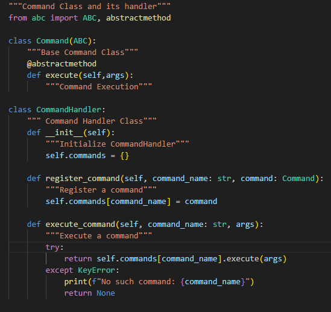

# IS601 Midterm

## How to Run

deactivate

pip install virtualenv 

pip install -r requirements.txt

virtualenv -p /usr/bin/python3 venv

source venv/bin/activate

pytest --cov

python3 main.py

## Commands

```
- Addition

add : num1 num2  

- subtract : num1 num2 Subtraction
- multiply : num1 num2  Multiplication
- divide : num1 num2  Division
- talk : args Prints out arguments
- menu : Shows the list of commands
- exit : Exits the application
- display : Shows Calculation History
- load : Loads Calculation History from file
- save : Save Calculation History to file 
- delete : index Delete a record from Calculation History at an index
- clear : Clears Calculation History
```


## Video

Create a 3-5 minute video demonstration of using the calculator, highlighting its key features and functionalities. Link the video to the repository readme.

## Design Patterns

***Command Pattern***

We Use Command Pattern as a base for all of our plugin commands



***Singleton Pattern***

Our main Application class acts as singleton for entire software


***Factory Pattern***

We use Command Pattern as a base for all of our plugin commands


***Template Method Pattern***

***Iterator Pattern***


## LLBYL/EAFP

***"Look Before You Leap" (LBYL)***

Look Before You Leap is used extensively in the HistoryManager


***"Easier to Ask for Forgiveness than Permission" (EAFP)***

Easier to Ask for Forgiveness than Permission is used all throughout, two instances of it are we use EAFP when loading up files and when executing commands


## Logging

Logging is used for tracking normal calculator operations as well as loading files, enivornment variables, errors, exceptions, and warnings. Logs are stored in logs/app.log


## Environment Variables

Environment variables are used in deciding enviroment for either production/development and another for the location of data output of our software


## Testing 

A high coverage of 94% is achieved in the tests

