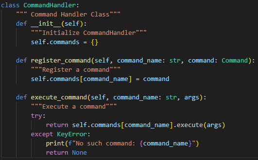
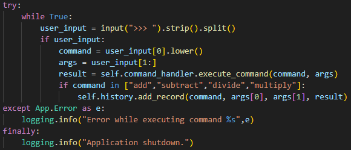
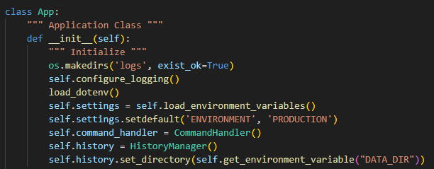
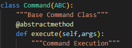
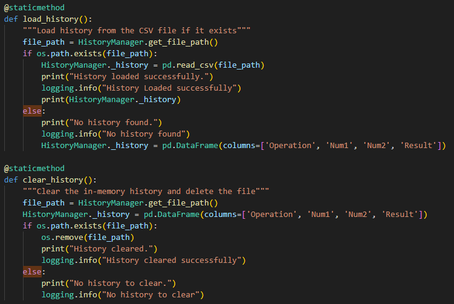
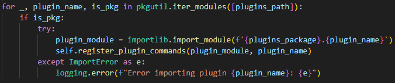
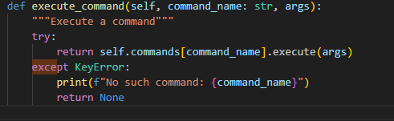
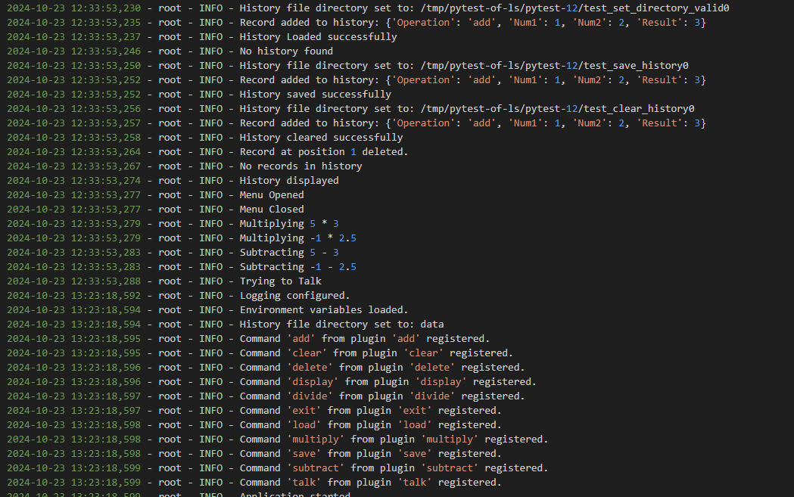
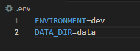
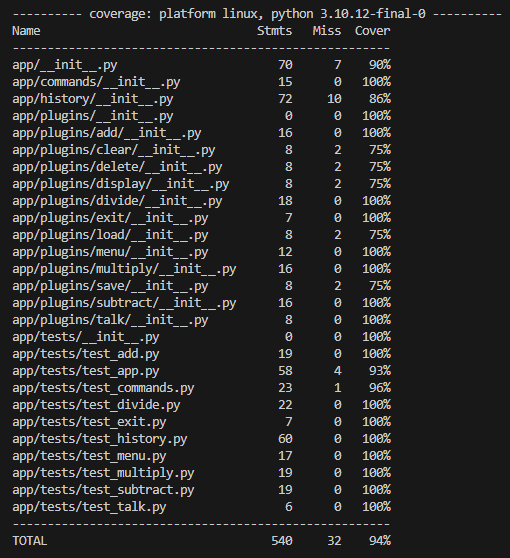

# IS601 Midterm

## How to Run

deactivate

pip install virtualenv 

pip install -r requirements.txt

virtualenv -p /usr/bin/python3 venv

source venv/bin/activate

pytest --cov

python3 main.py

## Commands

```
- Addition

add : num1 num2  

- Subtraction

subtract : num1 num2 

- Multiplication

multiply : num1 num2  

- Division

divide : num1 num2  

- Print out arguments

talk : args 

- Shows the list of commands

menu 

- Exits the application 

exit 

- Show Calculation History 

display

- Load Calculation History from file

load

- Save Calculation History to file 

save

- Delete a record from Calculation History at an index

delete : index 

- Clear Calculation History

clear

```


## Video

[Video Demonstration](images/video.mkv)

## Design Patterns

***Command Pattern***

We Use Command Pattern through CommandHandler for all of our commands



***REPL Pattern***

In our Application class we use a REPL loop as the main loop for our program



***Singleton Pattern***

Our main Application class acts as singleton for entire software



***Template Pattern***

We use Template Pattern through our abstract Command Class as a base for all of our plugin commands




## LLBYL/EAFP

***"Look Before You Leap" (LBYL)***

Look Before You Leap is used extensively in the HistoryManager



***"Easier to Ask for Forgiveness than Permission" (EAFP)***

Easier to Ask for Forgiveness than Permission is used all throughout, two instances of it are we use EAFP when loading up files and when executing commands





## Logging

Logging is used for tracking normal calculator operations as well as loading files, enivornment variables, errors, exceptions, and warnings. Logs are stored in logs/app.log



## Environment Variables

Environment variables are used in deciding enviroment for either production/development and another for the location of data output of our software



## Testing 

A high coverage of 94% is achieved in the tests

